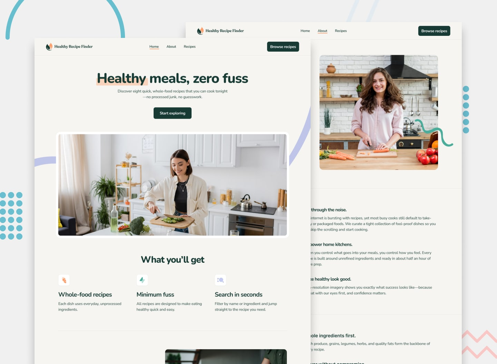

# Frontend Mentor - Recipe finder website

## Welcome! 👋

This is a solution to the [Recipe finder website challenge on Frontend Mentor](https://www.frontendmentor.io/challenges/recipe-finder-website--Ui-TZTPxN). Frontend Mentor challenges help you improve your coding skills by building realistic projects.

### Links

- My solution at : [GitHub Pages](https://yehudahason.github.io/Recipe-finder-website/#/recipes)

### Built with

- [React](https://reactjs.org/) - JS library

## Author

- Frontend Mentor - [Yehuda Hason](https://www.frontendmentor.io/profile/yehudahason)
